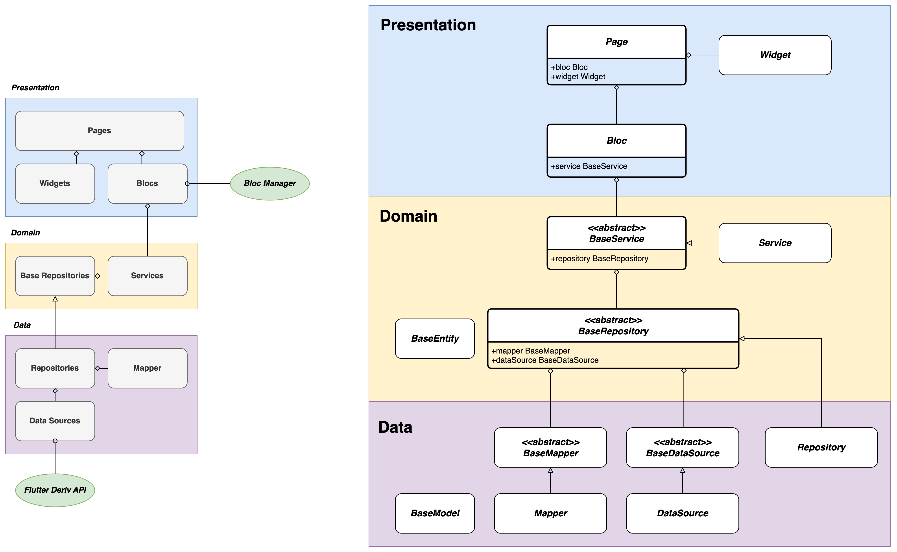

## Data Layer:

The data layer is responsible for handling data-related operations, such as data retrieval and persistence.

#### BaseModel:

This is a base class that represents a model in the data layer. It can be extended to define specific models with their respective properties and behavior.

#### BaseDataSource:

This is an abstract class that serves as the base for data sources. It is parameterized by the type M, which represents the corresponding model. Data sources are responsible for retrieving data from external sources, such as databases or APIs. The BaseDataSource class provides a blueprint for implementing specific data source classes.

#### DataSource:

This class is an implementation of the BaseDataSource abstract class. It represents a concrete data source that interacts with a specific external data provider. You would typically implement methods in this class to perform data retrieval and manipulation operations.

#### BaseMapper:

This abstract class defines the mapping between entity classes and model classes. It is parameterized by types E (representing the entity) and M (representing the model). Mappers are responsible for transforming data between the entity objects used in the domain layer and the model objects used in the data layer. This helps to separate the concerns of the domain and data layers.

#### Repository:

This class implements the BaseRepository interface. It represents a repository in the data layer, which acts as an intermediary between the data sources and the domain layer. The repository class typically uses a mapper and a data source to perform data operations, such as fetching data from a data source, mapping it to entity objects using the mapper, and returning the results to the domain layer.

#### Mapper:

This class implements the BaseMapper interface. It handles the mapping between entity classes and model classes. You would typically implement methods in this class to convert entity objects to model objects and vice versa.

## Domain Layer:

The domain layer contains the business logic and defines the entities, repositories, and services that operate on those entities.

#### BaseEntity:

This base class represents an entity in the domain layer. Entities typically encapsulate the core data and behavior of the application.

#### BaseRepository:

This abstract class serves as the base for repositories in the domain layer. It is parameterized by types E (representing the entity) and M (representing the model). Repositories are responsible for managing the data access and manipulation operations related to a specific entity. The repository class holds references to a mapper and a data source, allowing it to map model objects to entity objects and interact with the data source for data operations.

#### BaseService:

This abstract class serves as the base for services in the domain layer. Services contain the business logic and orchestrate the operations on entities. The base service class typically holds a reference to a repository, allowing it to perform data operations on the corresponding entities.

#### Service:

This class implements the BaseService interface. It represents a concrete service in the domain layer. You would typically implement methods in this class to define the specific business logic operations and use the repository to interact with the data layer.

## Presentation Layer:

The presentation layer is responsible for the user interface (UI) components and handling user interactions.

#### Bloc:

This class represents a business logic component. It typically contains the logic for handling user events, coordinating data operations, and managing the state of the application. The bloc class holds a reference to a service, allowing it to invoke the business logic operations defined in the service.

#### Widget:

This is a placeholder class representing a UI widget. In a real application, you would define specific UI components as widgets to be rendered on the screen.

#### Page:

This class represents a page in the presentation layer. It typically brings together the UI components (widgets) and the business logic component (bloc) to create a complete screen or view. The page class holds references to a bloc and a widget, allowing it to associate the UI with the corresponding business logic.

In summary, presented architecture follows a layered architecture where the data layer handles data retrieval and persistence, the domain layer contains the business logic and entities, and the presentation layer focuses on UI components and user interactions. The relationships between the classes allow for separation of concerns and maintainability of the codebase.

### Diagram Overview

### Class Relations

