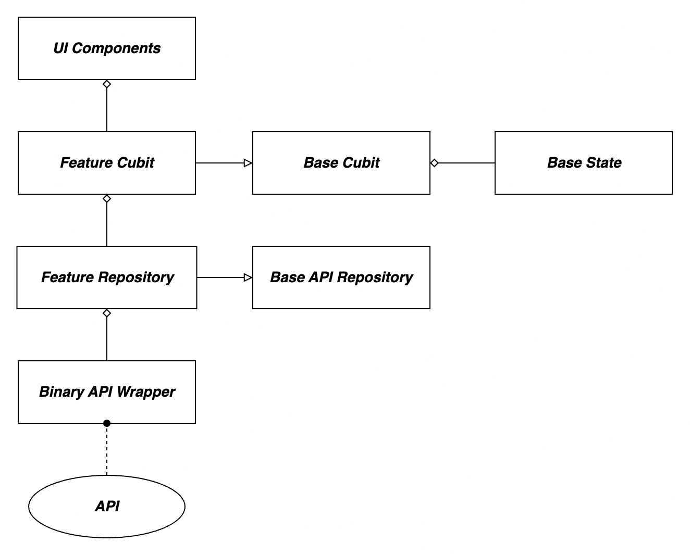
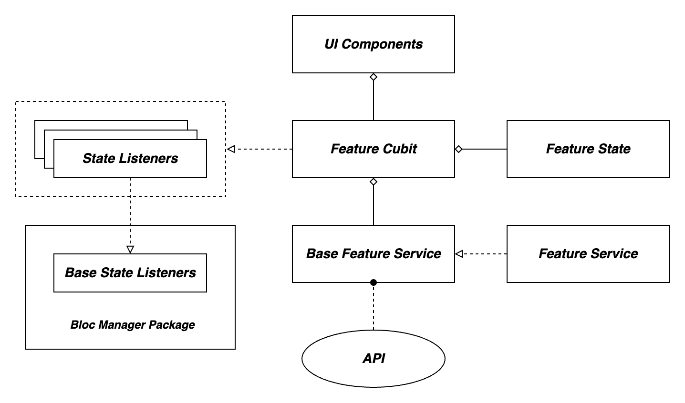

## What is software architecture?

Software architecture is the conceptual foundation and strategic framework for a software system. It encompasses the fundamental design decisions that shape the system's structure, behavior, and interactions. Like the architectural plan for a building, software architecture defines the arrangement of components, the pathways of data, and the mechanisms for achieving desired qualities such as performance, scalability, and maintainability. It serves as a blueprint that guides developers in creating a cohesive, reliable, and adaptable software solution that aligns with the project's objectives and user needs.

## Difference Between Software Architecture and Design Patterns?

Software architecture and design patterns are both crucial concepts in software development, but they serve distinct purposes and operate at different levels of abstraction. Let's delve into the differences between these two concepts:

### Software Architecture

Software architecture refers to the high-level structure and organization of a software system. It outlines the major components, their interactions, data flows, and the overall design decisions that shape the system.

- Scope

  Architecture provides the fundamental framework for the entire software application. It defines the system's major building blocks, their relationships, and the principles that guide their interactions.

- Abstraction Level

  Architecture operates at a higher level of abstraction, focusing on the system as a whole. It addresses questions like how components collaborate, how data moves, and how non-functional requirements are met.

- Goals

  Architecture addresses key system-wide concerns such as scalability, performance, security, and maintainability. It sets the strategic direction and lays the groundwork for the entire project.

### Design Patterns

Design patterns are reusable solutions to common software design problems. They provide templates for solving specific design challenges and promoting best practices.

- Scope

  Design patterns are smaller-scale solutions that target specific design problems within components or interactions. They help improve the design quality of individual parts of the system.

- Abstraction Level

  Design patterns operate at a lower level of abstraction than architecture. They focus on recurring design problems and offer guidelines for structuring code within components.

## Key Goals of Effective Software Architecture

Crafting a successful software architecture involves aiming for specific objectives that collectively contribute to the creation of a reliable, adaptable, and user-centric system. The following are the core goals that guide the development of effective software architecture:

- Functionality

  The architecture should provide the necessary features and capabilities to meet the intended requirements and fulfill user needs effectively.

- Scalability

  The architecture should support handling increased demands by adding resources or components and maintaining performance and responsiveness.

- Maintainability

  The architecture should make it easy to identify, fix, and update issues or enhancements, minimizing the cost and effort of ongoing maintenance.

- Modularity

  Components should be organized into discrete, cohesive modules that can be developed, tested, and maintained independently, promoting reusability and ease of updates.

- Reusability

  Design decisions should facilitate the reuse of components or patterns across different parts of the system or in future projects.

- Testability

  Designing the architecture to facilitate comprehensive testing, enabling efficient validation of the system's functionality, performance, and reliability.

## Current Mobile Team Architectures

### Deriv P2P Architecture

#### Main Architecture Components

- BinaryApiWrapper

  This component is responsible for connecting to the Flutter Deriv API. In fact We need this component to make Flutter Deriv API compatible with P2P app.

- BaseAPIRepository

  This is a base class that provides common methods and functionalities for repositories that interact with APIs.

- Features Repositories

  These repositories utilize the BinaryApiWrapper to interact with the Deriv API and provide data to the feature cubits.

- Feature Cubits

  Cubits are a part of the Bloc pattern architecture, commonly used with Flutter apps. They manage the state of the UI related to specific features. Each feature cubit extends the BaseCubit class, which includes states like initState, LoadingState, LoadedState, and ErrorState.

### Deriv GO Architecture

#### Main Architecture Components
