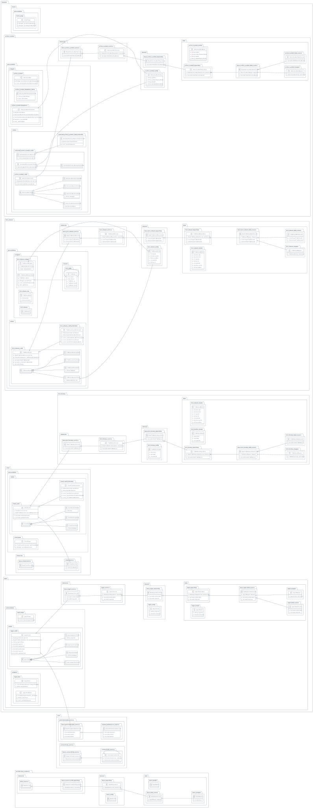

## Architecture Overview

This document presents an architecture proposal for the project, outlining the different components and their roles. The proposed architecture follows a layered approach, promoting modularity, abstraction, and code reusability.

## Introduction

In software development, choosing the right architecture is crucial for building robust, scalable, and maintainable applications. This architecture proposal aims to provide a solid foundation for the project, enabling developers to efficiently organize and manage the codebase.

The proposed architecture follows a layered approach, dividing the application into different layers, each with its own responsibilities. This separation of concerns allows for easier maintenance, testing, and extensibility. The key components of the architecture include data sources, repositories, mappers, services, and blocks.

### Layers

#### 1. Data Layer

The data layer is responsible for handling data retrieval and storage. It consists of data sources and repositories.

##### Data Sources

Data sources encapsulate the logic for retrieving data from various sources, such as databases, APIs, or local storage. They implement the common methods defined in the `BaseDataSource` abstract class, allowing for consistent data access across different sources. In the proposed architecture, there are concrete implementations of data sources, such as `RemoteFeatureDataSource` and `LocalFeatureDataSource`, which retrieve data for the specific feature.

##### Repositories

Repositories act as an intermediary between the data layer and the domain layer. They encapsulate the data access logic, allowing the domain layer to interact with the data sources without directly accessing them. Repositories implement the `BaseRepository` abstract class, which defines the common behavior for working with data sources and mappers. The repositories use data sources to retrieve data and mappers to convert the retrieved data into domain entities. In the architecture, there is a concrete implementation of the `FeatureRepository` class, which provides access to the feature's data source and mapper.

The data layer ensures that data retrieval and storage operations are decoupled from the business logic, promoting separation of concerns and maintainability. It also allows for flexibility in choosing different data sources or implementing caching strategies without affecting the higher layers.

#### 2. Domain Layer

The domain layer contains the core business logic of the application. It represents the problem domain and defines the entities and operations that manipulate and process the data.

##### Entities

Entities are the fundamental data structures in the application. They represent the real-world concepts and encapsulate the business rules and behavior related to the data. In the proposed architecture, the domain layer includes concrete implementations of entities, such as `FeatureEntity`, which represents the entity specific to the feature.

##### Mappers

Mappers are responsible for converting data between entities and data models. They implement the `BaseMapper` abstract class, which defines the methods for mapping entities to models and vice versa. Mappers ensure the separation of concerns between the data layer and the domain layer. In the proposed architecture, there is a concrete implementation of the `FeatureMapper` class, which performs the mapping between `FeatureEntity` and `FeatureModel`.

The domain layer encapsulates the business logic and rules, ensuring that the core functionality of the application remains independent of specific data sources or presentation details. It provides a clear and concise representation of the problem domain and facilitates easy maintenance and extensibility.

### Architecture Comparison

| Architecture          | Benefits                                                                                                                                                                                                                                                                                                                                    | Weaknesses                                                                                                                                                                                                                                                                                                                                                          |
| --------------------- | ------------------------------------------------------------------------------------------------------------------------------------------------------------------------------------------------------------------------------------------------------------------------------------------------------------------------------------------- | ------------------------------------------------------------------------------------------------------------------------------------------------------------------------------------------------------------------------------------------------------------------------------------------------------------------------------------------------------------------- |
| Provided Architecture | - Modularity and code organization - Abstraction and flexibility - Separation of concerns - Code reusability - Scalability                                                                                                                                                                                                      | - Complexity: Increased complexity due to numerous components and abstractions - Boilerplate Code: Potential for additional boilerplate code - Potential Overengineering: May be excessive for smaller projects or simpler requirements - Learning Curve: May require time for the team to adapt - Increased development time due to configuring layers |
| MVC                   | - Separation of concerns between data, UI, and user input handling - Testability through separation of logic - Improved maintainability and code organization                                                                                                                                                                         | - Tight coupling between View and Controller - Limited reusability due to dependencies between components - Bloated Controller with business logic                                                                                                                                                                                                            |
| MVVM                  | - Separation of concerns between UI and business logic - Testability through data binding and dependency injection - Improved maintainability and code reusability - Simplified UI logic with data binding                                                                                                                         | - Complexity due to the introduction of the ViewModel - Tight coupling between View and ViewModel                                                                                                                                                                                                                                                                |
| Clean Architecture    | - Emphasis on separation of concerns and dependency inversion - Modularity and domain-centric design - Testability and maintainability through clear boundaries - Improved code maintainability and scalability - Scalability through abstraction and flexibility - Code reusability through abstract classes and interfaces | - Complexity due to multiple layers and abstractions - Potential for additional boilerplate code - Potential performance impact due to indirection and conversions between layers                                                                                                                                                                             |

### Benefits

- **Modularity**:
  The architecture promotes modularity by dividing the application into distinct layers and components. Each layer has a specific responsibility and can be developed and maintained independently. This modularity allows for better organization, separation of concerns, and encapsulation of functionality. Developers can focus on a specific layer without needing to understand the entire application, making the codebase more manageable and easier to maintain.

  Modularity also facilitates code reusability. With clearly defined boundaries between components, developers can easily reuse and share code across different features or modules, reducing duplication and improving overall code quality and consistency.

- **Abstraction**:
  The use of abstract classes and interfaces in the architecture provides a level of abstraction. Abstract classes define common behavior and contracts that concrete implementations must adhere to. This abstraction allows for flexibility and extensibility, as different implementations can be easily swapped or added without affecting other parts of the system.

  Abstraction also promotes testability. By relying on interfaces and abstract classes, unit testing becomes easier since dependencies can be mocked or stubbed. Testability is crucial for building robust and maintainable applications, as it allows for thorough testing of individual components, ensuring their correctness and reliability.

- **Abstraction**:
  The architecture emphasizes the separation of concerns, dividing the application into layers with distinct responsibilities. The data layer handles data retrieval and storage, the domain layer contains the core business logic, and the presentation layer focuses on the user interface and interaction.

  This separation allows for a clear distinction between different types of logic and facilitates maintainability. Developers can work on specific layers without interfering with others, enabling parallel development and reducing the risk of introducing unintended side effects.

  Separation of concerns also improves code readability and understandability. With well-defined boundaries and responsibilities, it becomes easier to locate and modify specific functionality. This promotes code comprehension and makes it easier for developers to collaborate on the project.

- **Code Reusability**:
  The architecture encourages code reusability through the use of abstract classes, interfaces, and modular design. Abstract classes define common behavior and can be extended by multiple concrete implementations. Interfaces provide contracts that can be implemented by different classes.

  Code reusability reduces duplication and improves development efficiency. Developers can leverage existing components and implement new features by reusing code from other parts of the application. This leads to cleaner and more maintainable codebases and helps maintain consistency across the project.

- **Scalability**:
  The proposed architecture provides a scalable foundation for the project. By separating the application into distinct layers, it becomes easier to add new features, modules, or integrations without disrupting existing functionality.

  Each layer has clear responsibilities and boundaries, enabling developers to focus on specific areas of development. This promotes parallel development and enables teams to work on different features concurrently, increasing productivity and reducing time-to-market.

  Scalability is further supported by modular design and abstraction. New components can be added or replaced without affecting the entire system, allowing the application to evolve and adapt to changing requirements and business needs.

### Weaknesses

While the proposed architecture offers several benefits, it also comes with a few potential weaknesses that should be taken into consideration:

1. **Complexity**: The proposed architecture introduces a significant number of components and abstractions, which may increase complexity, especially for smaller projects or teams unfamiliar with the architecture. The abundance of layers, data sources, repositories, mappers, and services can make the codebase more intricate and harder to grasp. This complexity may require additional effort and expertise from the development team to understand, implement, and maintain the architecture effectively.

2. **Boilerplate Code**: The use of abstract classes and interfaces in the architecture can lead to the creation of additional boilerplate code. Developers may need to write more code compared to a simpler architecture, especially when defining and implementing the various abstract classes, interfaces, and mapping methods. This increased verbosity can be a trade-off for the flexibility and reusability provided by the architecture.

3. **Potential Overengineering**: Depending on the size and requirements of the project, the proposed architecture may be considered overengineered. Smaller projects with limited complexity may not fully benefit from the added layers of abstraction and complexity introduced by the architecture. In such cases, the overhead of maintaining and implementing the architecture may outweigh the advantages it offers, leading to unnecessary complexity and development effort.

4. **Learning Curve**: The proposed architecture introduces various layers, components, and abstractions, which may have a steeper learning curve for developers who are unfamiliar with the architecture. Developers need to understand the concepts and principles behind each layer and how they interact with one another. This learning curve may require additional time and resources for training and onboarding new team members.

5. **Increased Development Time**: The presence of multiple layers, abstractions, and interfaces in the architecture may result in increased development time. Developers may need to spend additional time setting up and configuring the layers, implementing mappings between entities and models, and managing dependencies between different components. This additional time investment should be considered when evaluating the feasibility of adopting the proposed architecture.

### Suitable Projects for the Proposed Architecture

The proposed architecture can be suitable for a wide range of projects, particularly those that prioritize:

1. **Medium to Large Scale Applications**: The architecture provides a structured approach for managing complexity and organizing code in larger applications. It offers a clear separation of concerns and allows for easy maintenance and scalability. This makes it ideal for projects with a significant codebase and multiple interconnected components.

2. **Enterprise Applications**: The proposed architecture's emphasis on modularity and domain-centric design makes it suitable for building enterprise-level applications. Enterprises often have complex business requirements and need a flexible architecture to accommodate future growth and changes. The proposed architecture's modular structure enables independent development and maintenance of different modules or features.

3. **Complex Systems**: Projects that involve complex business logic, data manipulation, or multiple interconnected components can benefit from the proposed architecture's layered structure. The clear separation of concerns promotes maintainability and makes it easier to understand and modify specific components without affecting the entire system. This is advantageous for projects that require intricate data flows or extensive business rules.

4. **Projects with Evolving Requirements**: The architecture's modular and flexible nature allows for easier adaptation and modification as project requirements evolve over time. The clear separation between layers and components facilitates adding new features or making changes without impacting the entire system. This flexibility is particularly valuable for projects that anticipate frequent updates or expansions.

5. **Team Collaboration**: The architecture's clear separation of concerns and defined boundaries between layers can facilitate collaboration among team members. Different developers can work on specific layers or modules without affecting others, promoting parallel development and easier code integration. This separation also enables more efficient code reviews, debugging, and maintenance, making it easier for teams to work together effectively.

6. **Testability**: The architecture's focus on decoupling components and dependency inversion greatly enhances testability. By isolating components, it becomes easier to write unit tests that verify individual functionalities. The use of interfaces and dependency injection allows for the substitution of dependencies with mocks or stubs, enabling more thorough testing of different scenarios. This is beneficial for projects that prioritize code quality and maintainability through comprehensive testing practices.

### Steps to Create a Project Based on the Proposed Architecture

1. **Project Setup**: Set up a new project in your preferred development environment (IDE) and choose the programming language that aligns with the proposed architecture.

2. **Create the Core Modules**:

   - Define the `BaseStateListener` abstract class and implement the `StateListener` class for handling state changes.
   - Define the `BaseDataSource` abstract class to represent the data sources in your project.
   - Create the `BaseModel` abstract class as the base model for your project's data models.
   - Define the `BaseDataSources` abstract class that extends `BaseDataSources<BaseModel>`.
   - Define the `BaseEntity` abstract class to represent the entities in your project.
   - Create the `BaseMapper` abstract class that takes generic types `E` and `M` to define the mapping between entities and models.
   - Create the `BaseRepository` class with a constructor that takes a `BaseMapper` and `BaseDataSource` as parameters.

3. **Implement the Core Functionality**:

   - Create the necessary data classes, such as `FeatureModel`, `FeatureEntity`, and `FeatureMapper`, that extend the base classes defined in the core modules.
   - Implement the `BaseFeatureDataSource` interface by creating concrete classes `RemoteFeatureDataSource` and `LocalFeatureDataSource`. Override the `getData` method to retrieve the feature data from remote or local sources.
   - Implement the `BaseFeatureRepository` interface by creating the `FeatureRepository` class. Implement the `dataSource` and `mapper` properties, returning instances of the data source and mapper classes, respectively.
   - Implement the `BaseFeatureService` interface by creating the `FeatureService` class. Implement the `repository` property and the `getData` method, which uses the repository's mapper and data source to fetch and map the feature data.

4. **Create the Presentation Layer**:

   - Create the necessary UI components, such as widgets and pages, that will interact with the core functionality.
   - Implement the `ExtendedBloc` class, which extends `Bloc` and implements `StateListener`. Implement the necessary methods and define additional functionality as per your project's requirements.
   - Create the `Bloc` class, which takes a `BaseFeatureService` as a parameter and handles the business logic of the UI components.

5. **Wire it All Together**:

   - Instantiate the necessary objects and dependencies in your application's entry point.
   - Connect the UI components with the appropriate blocs and services.
   - Set up the necessary event listeners and state management for the UI components.

6. **Test and Refine**:
   - Write unit tests for the core functionality, data sources, repositories, mappers, and services to ensure they work as expected.
   - Test the UI components and blocs for proper interaction and behavior.
   - Refine the implementation as needed, considering the feedback from testing and code reviews.

An example project based on the proposed architecture can be found [here](example/).

## Conclusion

The proposed architecture emphasizes modularity, abstraction, and separation of concerns. It aims to provide a scalable and maintainable foundation for the project. However, it is important to consider the project's specific needs and trade-offs before adopting the proposed architecture.
