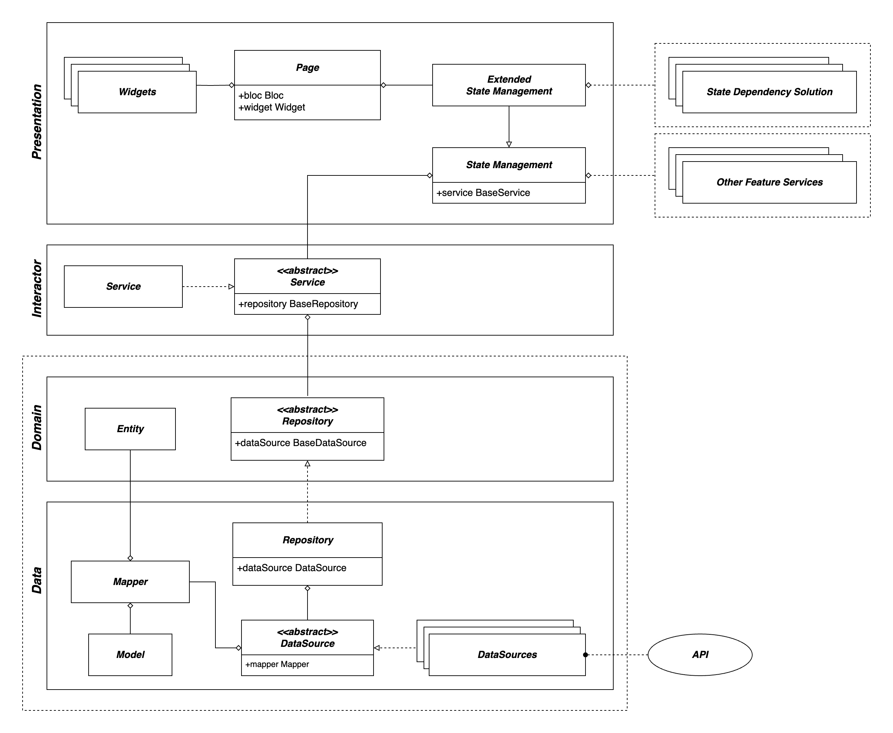

# Architecture Overview

This architecture follows a clean architecture pattern and consists of three main layers: the presentation layer, the domain layer, and the data layer. Each layer has its own set of classes and responsibilities, which are briefly described below.

The architecture is divided into three main layers: the data layer, domain layer, and presentation layer. Each layer has its own set of responsibilities and interacts with the other layers through well-defined interfaces.

### Data Layer

The data layer is responsible for handling data retrieval and storage. It consists of the following components:

- **Model**: The `Model` class represents the data model used in the application. It implements the `BaseModel` interface defined in the domain layer.

- **Mapper**: The `Mapper` class is responsible for mapping between the entities in the domain layer and the models in the data layer. It implements the `BaseMapper` interface, which defines the mapping behavior.

- **DataSource**: The `DataSource` class provides the actual data retrieval and storage implementation. It interacts with external data sources such as databases, APIs, or local storage. It implements the `BaseDataSource` interface, which defines the data source operations.

- **Repository**: The `Repository` class acts as a bridge between the data layer and the domain layer. It implements the `BaseRepository` interface and encapsulates the data retrieval logic using the `DataSource` and `Mapper` components. The repository is responsible for fetching data from the data source and mapping it to domain entities.

### Domain Layer

The domain layer contains the business logic of the application and defines the core entities and interactions. It consists of the following components:

- **BaseModel**: The `BaseModel` class defines the base model interface, which represents the data model used in the application.

- **BaseEntity**: The `BaseEntity` class defines the base entity interface, which represents the domain entities used in the application.

- **BaseMapper**: The `BaseMapper` class defines the base mapper interface, which specifies the mapping behavior between domain entities and data models.

- **BaseDataSource**: The `BaseDataSource` class defines the base data source interface, which declares the data retrieval and storage operations.

- **BaseRepository**: The `BaseRepository` class defines the base repository interface, which encapsulates the data retrieval logic and provides an abstraction for accessing data from the data source. It depends on the `BaseMapper` and `BaseDataSource` interfaces.

- **BaseService**: The `BaseService` class defines the base service interface, which encapsulates the business logic operations. It depends on the `BaseRepository` interface.

### Presentation Layer

The presentation layer is responsible for displaying the user interface and handling user interactions. It consists of the following components:

- **Entity**: The `Entity` class represents the domain entity used in the presentation layer. It implements the `BaseEntity` interface.

- **Service**: The `Service` class implements the `BaseService` interface and provides the implementation of the business logic operations. It depends on the `BaseRepository` interface.

- **ExtendedBloc**: The `ExtendedBloc` class extends the `Bloc` class and implements the `StateListener` interface. It represents a specific type of business logic component in the presentation layer. It interacts with the `Service` and handles state changes. It implements the `onState()` method defined in the `StateListener` interface.

- **Bloc**: The `Bloc` class represents a general business logic component in the presentation layer. It interacts with the `Service` and encapsulates the business logic operations.

- **Widget**: The `Widget` class represents a UI component in the presentation layer.

- **Page**: The `Page` class represents a screen or page in the application. It combines a `Bloc` and a `Widget` to bind the business logic and the UI together.

## Usage

To use this architecture in your application, you can follow these steps:

1. Define your domain entities by implementing the `BaseEntity` interface.
2. Create data models by extending the `BaseModel` class and defining the necessary properties.
3. Implement the `BaseMapper` interface to define the mapping behavior between your domain entities and data models.
4. Implement the `BaseDataSource` interface to provide the data retrieval and storage implementation.
5. Implement the `BaseRepository` interface by extending the `BaseRepository` class and providing the necessary `Mapper` and `DataSource` instances.
6. Implement the `BaseService` interface by extending the `BaseService` class and providing the necessary `Repository` instance.
7. Create your UI components (`Widget` classes) and business logic components (`Bloc` classes) based on your application requirements.
8. Combine the business logic and UI components using the `Page` class to create screens or pages in your application.

Ensure that you properly define dependencies between the layers and use interfaces to enable loose coupling and easier testing.

### Overview Diagram

### Generic Domain Diagram

### UML Diagram

